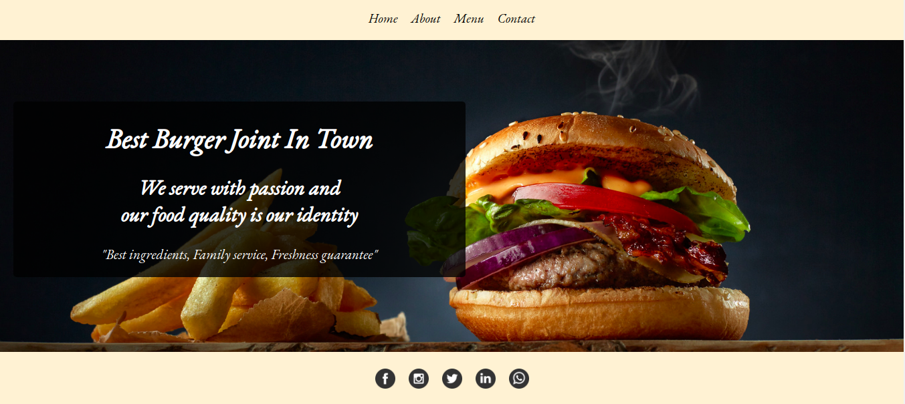
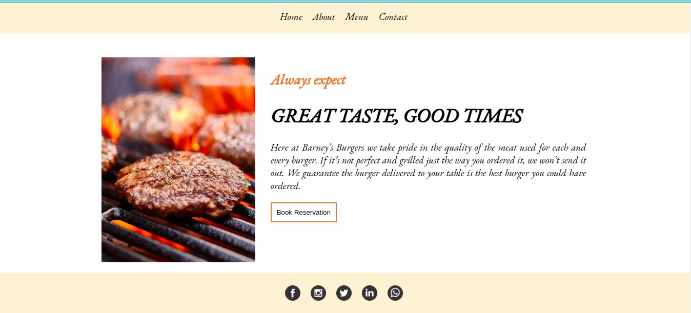
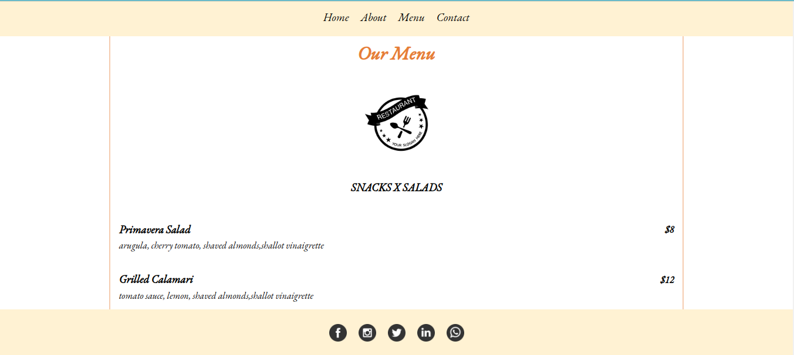
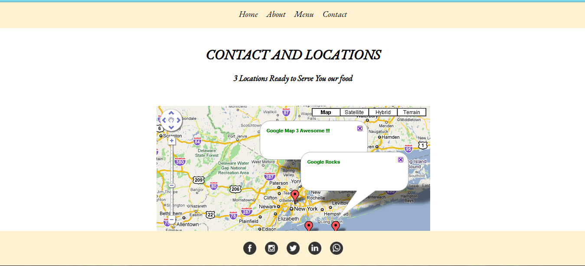

# Restaurant_page_js

> This is a Microverse javascript project which creates a dynamic restaurant website.The requirement of this project was to build a Restaurant Page. This project was designed for practicing DOM manipulation by dynamically rendering a simple restaurant homepage! Only javascript was used to render all the website content. All the content of different page was created by javascript and it doesn't need any kind of browser reload to render other pages.  








## Live Demo

[Restaurantpage](https://blazeburger.netlify.app/)

## Built With

- HTML
- CSS
- VANILA JAVASCRIPT
- Atom text editor
- Webpack
- Npm

# Getting Started

To get a local copy of the repository please run the following commands on your terminal:

```
$ cd <folder>
```

```bash

$ git clone `https://github.com/ajkacca457/Restaurant_page_js.git`
$ cd Restaurant_page_js
$ bundle install
$ Run `npm install` to install the necessary modules

```

# Authors

👤 **Avijit Karmaker**

- Github: [@Avijit](https://github.com/ajkacca457)
- Linkedin:[@Avijit](https://www.linkedin.com/in/avijit-karmaker-8738a54)

## 🤝 Contributing

Contributions, issues and feature requests are welcome!

## Show your support

Give a ⭐️ if you like this project!

## Copyright
This is a project developed by Microverse Student as the part of skill curriculum.
